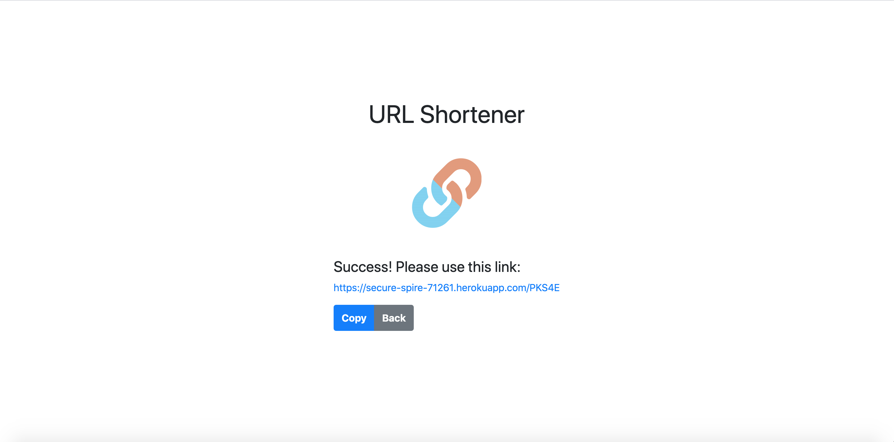

# 短網址產生器 - Mongoose

#### 使用者於表單中輸入網址後，可生成短網址，輸入短網址後，瀏覽器就會導向原本的網站

#### 環境
1. node.js v-10.15.0
2. 專案套件
> - body-parser
> - express
> - express-handlebars
> - mongoose
> - randomstring
> - valid-url

#### 確認本機是否安裝 [Mongodb](https://www.mongodb.com/download-center/community) 、 [Robo 3T](https://robomongo.org/)

#### 開啟終端機到存放專案本機位置並執行:
`git clone https://github.com/henry22/url-shortener`

#### 初始設定
```
1. 切換目錄到專案: url-shortener
2. 安裝套件: npm install
3. 開啟 Robo 3T，並在 localhost 上面按右鍵 Create Database，建立一個新的資料庫 url
```

#### 執行程式
```
1. 終端機輸入: npm run dev
2. 開啟網頁輸入: http://localhost:3000
```

## 主要功能
1. 首頁畫面上有一個表單，使用者可以在表單輸入原始網址，如 [This link](https://www.google.com)；送出表單之後，畫面會回傳格式化後的短網址，如 [This link](https://your-project-name.herokuapp.com/6y7UP)
2. 在伺服器啟動期間，使用者可以在瀏覽器的網址列，輸入你提供的短網址（如 [This link](https://your-project-name.herokuapp.com/6y7UP)），瀏覽器就會導向原本的網站（如 [This link](https://www.google.com)）
3. 使用者可以按 Copy 來複製縮短後的網址

## 截圖


